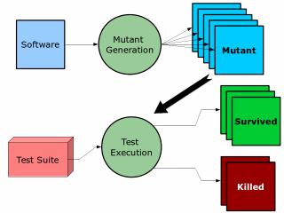

# Mutation Testing with Pitest

## 📖  Introduction

In this workshop we will be learning about Mutation Testing and how to use Pitest in a Java Maven project.

Mutation Testing is a concept first introduced in a paper from 1978 from _DeMillo_, _Lipton_ and _Sayward_. 
It is a technique that, in spite of the name, does not test the codebase but the robustness of its test suite.

In other words, it tests the quality of the tests. 
This brings us again to the issue we have seen in the workshop over best practices for unit testing: code coverage is not a metric for code quality.
Mutation Testing helps us to identify if our tests cover all necessary edge cases.

## 🤔 How does Mutation Testing work?

A Mutation Testing tool works by seeding into the codebase a series of faults, called _mutants_ and running the tests against them. 
If a test in the suite fails, the mutant is said to be _killed_. If all tests pass, the mutant _survived_.



Mutation Testing is a white box testing technique, since it needs knowledge over the internal code to generate the _mutations_. Example of mutants can be replacement of boolean expressions, arithmetic operations, boolean operations, statement alterations, etc...

The quality of the code, called _mutation score_ is then calculated as the percentage of _mutants_ killed over the total number of mutants.

    mutation score = number of killed mutants / total number of generated mutants

If a _mutant_ survives the tests, the developer should analyze the behavior of the original code that was modified by the mutant with the assumption that the existing tests for the code are eather irrelevant, incomplete or non-existent. 
The test suite has to be updated so that it identify the behavior of the _mutant_ in order to kill it.

The mutators, depending on the tool, can apply a certain change either on the source files (inefficient) or on the compiled code (efficient).

A Complete list of Pitest mutators can be found [here](https://pitest.org/quickstart/mutators/).

### 🧠 Let's talk about Advantages and Disadvantages of Mutation Testing

Take some minutes to discuss together the veridicity of the following statements:
- Mutation Testing helps to identify dead code
- Mutation Testing increases the quantity of my unit tests
- To run mutation tests can take a long time
- Mutation Testing helps identify code that needs a simpler design
- Mutation Testing should be implemented in a later stage of the development process

Are there other advantages and disadvantages to Mutation Testing that you can think of?

----
#### ✍️ Exercise 1

Given the following function:

```java
public boolean isEligibleForDrivingLicense(int age) {
    if (age >= 18) {
        return true;
    }
    return false;
}
```

Consider now the following test:

```java
@Test
public void testIsEligibleForDrivingLicense() {
    assertFalse(isEligibleForDrivingLicense(10));
    assertTrue(isEligibleForDrivingLicense(20));
}
```

1) Which among the list of Pitest mutators creates a mutant that is not killed by the test? 
    > Conditionals Boundary Mutator (CONDITIONALS_BOUNDARY)
2) How does the mutant looks like?
    ```java
    public boolean isEligibleForDrivingLicense(int age) {
        if (age > 18) {
            return true;
        }
        return false;
    }
    ```
3) Modify the test to kill the mutant.
    ```java
    @Test
    public void testIsEligibleForDrivingLicense() { 
        assertFalse(isEligibleForDrivingLicense(17));
        assertTrue(isEligibleForDrivingLicense(18));
    }
    ```
----

### Equivalent Mutations

If a mutation behaves exactly as the original code, it is referred as being an `equivalent mutation`. 
These mutations are syntactically different from the original code but semantically equivalent. They are false positives!

----
#### ✍️ Exercise 2

Given the following code:
```java
boolean isLowerCase(char c) {
    return (c >= 'a') && (c <= 'z');
}
```

Write an equivalent mutation:
```java
boolean isLowerCase(char c) {
    return (c >= 'a') == (c <= 'z');
}
```
----

## How to use Pitest in a Java Maven project

### Configuration

Let us configure PIT as a Maven plugin in our project as described in the [PIT Quickstart](https://pitest.org/quickstart/maven/).

Add the following plugin to the `pom.xml` file:

```xml
<plugin>
    <groupId>org.pitest</groupId>
    <artifactId>pitest-maven</artifactId>
    <version>1.20.2</version>
</plugin>
```

To avoid PIT to mutate all the code of our Project, we can configure the plugin using the `targetClasses` parameter to specify the classes we want to mutate.
If such parameter is not set, PIT will read all classes included in the pom `groupId` package.

The parameter `targetTests` can be used to specify the tests we want to run against the mutants. This parameter is for new versions of PIT not required anymore, but can help performances in project with a large code base.

```xml
<plugin>
    <groupId>org.pitest</groupId>
    <artifactId>pitest-maven</artifactId>
    <version>1.20.2</version>
    <dependencies>
        <dependency> <!-- Otherwise only JUnit 4 is supported out of the box -->
            <groupId>org.pitest</groupId>
            <artifactId>pitest-junit5-plugin</artifactId>
            <version>1.2.3</version>
        </dependency>
    </dependencies>
    <configuration>
        <!-- no longer required -->
        <targetClasses>
            <param>com.your.package.root.want.to.mutate*</param>
        </targetClasses>
        <!-- no longer required -->
        <targetTests>
            <param>com.your.package.root*</param>
        </targetTests>
    </configuration>
</plugin>
```

### 🏃 Running the mutation tests

PIT can be run using the `mutationCoverage` maven goal:

    mvn test-compile org.pitest:pitest-maven:mutationCoverage

----
#### ✍️ Exercise 3

1) Try to run the mutations tests as showed above. You will get an error...
2) Add the following configuration in the PIT plugin:

   ```xml
    <configuration>
        <verbose>true</verbose>
    </configuration>
    ```
3) Run the tests again and observe the error message in the log. Can you figure out what the problem is, and fix it?

----

### Some other configuration parameters

To limit the runtime execution of the mutation tests, we can add the set of the mutators to include in the analysis in the plugin configuration:
```xml
<configuration>
    <mutators> <!-- It accepts Mutators groups or single mutators -->
        <mutator>ALL</mutator>
        <mutator>NON_VOID_METHOD_CALLS</mutator>
    </mutators>
</configuration>
```

Another useful configuration parameter is `avoidCallsTo`, which exclude mutations to defined packages. This is used by PIT by default to avoid to mutate classes contained in logging and commons packages.

```xml
<avoidCallsTo> <!-- These are the default values -->
    <avoidCallsTo>java.util.logging</avoidCallsTo>
    <avoidCallsTo>org.apache.log4j</avoidCallsTo>
    <avoidCallsTo>org.slf4j</avoidCallsTo>
    <avoidCallsTo>org.apache.commons.logging</avoidCallsTo>
</avoidCallsTo>
```

The plugin can be configured tighter in the build process with the parameters `mutationThreshold` or `coverageThreshold` that define the scores for mutation score and line coverage under which the build should fail:
```xml
<mutationThreshold>90</mutationThreshold>
<coverageThreshold>80</coverageThreshold>
```

Take a look in the official documentation under the [PIT Maven Quickstart page](https://pitest.org/quickstart/maven/) for more details about the plugin configuration, there is a ton of them.

### 🔬 Analyzing the results

Run the mutation tests to generate an HTML report. 
The resulting HTML report will be stored in the `target/pit-reports/` directory.

The report can be also generated as XML or CSV using the `outputFormats` parameter:
```xml
<outputFormats>
    <outputFormat>HTML</outputFormat>
    <outputFormat>XML</outputFormat>
    <outputFormat>CSV</outputFormat>
</outputFormats>
```

----

#### ✍️ Exercise 4

1) Run the mutation tests and open the file `target/pit-reports/index.html` to analyze the results.
2) In the report for the class `Triangle.java` you can examine which mutants survived and where they applied changes to the code that were not detected.
3) Kill all the mutants of the line 13 of the class `Triangle.java` detected in the report!

----

## Optional: Upload PIT Report to SonarQube

It is possible to integrate the PIT report into the SonarQube dashboard using the plugin [Mutation Analysis](https://www.devcon5.ch/en/products_and_services/products/sonarqube-mutation-plugin/).
This part of the Workshop is optional, since differences in development environments can make it difficult to perform the tasks together, and also system restarts could be required.

Let's try to achieve this by setting up a SonarQube server in a Docker container. 
All the following commands refer to a Fedora environment.

1) Install Docker in your system:
   > sudo dnf -y install dnf-plugins-core
   
   > sudo dnf-3 config-manager --add-repo https://download.docker.com/linux/fedora/docker-ce.repo

   > sudo dnf install docker-ce docker-ce-cli containerd.io docker-buildx-plugin docker-compose-plugin
2) Add your user to the Docker group (could require a system restart):
   > sudo usermod -a -G docker *{your_user_name}*
3) Start the Docker Engine (without setting Docker to start automatically at system startup):
   > sudo systemctl start docker
4) In IntelliJ: 
   1) Go to *Services* and create a new Docker connection to a default Unix socket (in my case).
   2) In the Docker service, under images, pull the image `sonarqube:latest`.
   3) Under Containers, create a new container from the image `sonarqube:latest`.
   4) Start the container.
5) In the Browser:
   1) Login to SonarQube under `http://localhost:9000` with default *admin/admin* credentials.
   2) Go under *Administration -> Marketplace* and install the Plugin *Mutation Analysis*. Restart the server.
   3) Under *Quality Profiles*, select *Java* in the language filter, you should be able to see both `Sonar Way` and `Mutation Analysis` profiles.
   4) Extend the Sonar Way profile with the Mutation Analysis plugin rules.
   5) Set the newly created Profile as default.

Now we have a Sonar instance up and running and when a pit report will be uploaded, it should be possible to see it in the dashboard.

Let's configure now the Project:
1) Install the `sonar-maven-plugin` in the project, so that it will be executed with the `sonar` profile
    ```xml
    <profiles>
        <profile>
            <id>sonar</id>
            <properties>
                <sonar.host.url>http://localhost:9000</sonar.host.url>
            </properties>
            <build>
                <plugins>
                    <plugin>
                        <groupId>org.sonarsource.scanner.maven</groupId>
                        <artifactId>sonar-maven-plugin</artifactId>
                        <version>5.2.0.4988</version>
                        <executions>
                            <execution>
                                <phase>compile</phase>
                                <goals>
                                    <goal>sonar</goal>
                                </goals>
                            </execution>
                        </executions>
                    </plugin>
                </plugins>
            </build>
        </profile>
    </profiles>
    ```
2) In Sonar, go under *Administration -> Security -> Users* and create a Token for the user `admin`.
3) In the `pom.xml` add the following property:
    ```xml
    <properties>
        <sonar.login>admin_token</sonar.login>
    </properties>
    ```
4) Add in the configuration of PIT plugin the creation of an XML report

Now it is possible to generate a report and upload it to SonarQube wit the command:
    
> mvn sonar:sonar

----

#### ✍️ Exercise 5

1) Upload a Mutation Test report to SonarQube
2) Log in to SonarQube and observe the dashboard
3) Exclude the `Main.java` class from the analysis
4) Kill all remaining mutants in the class `Triangle.java`

----

## 🛬 Conclusion

- In this workshop learned the theory behind mutation testing and why it is helpful in the context of unit testing.
- We learned to use Pitest as a Maven plugin to generate a report of the mutants detected in the codebase.
- We learned how to install the *Mutation Analysis* Plugin in SonarQube and how to upload a Mutation Test report to it.

## 📚 Resources
- _Marco Tulio Valente_, Software Engineering: A Modern Approach: [Mutation Testing: A Practical Overview](https://softengbook.org/articles/mutation-testing)
- _R.A. DeMillo; R.J. Lipton; F.G. Sayward_, [Hints on Test Data Selection: Help for the Practicing Programmer](https://ieeexplore.ieee.org/document/1646911)
- [Pitest](https://pitest.org/) official website
- _Benjamin Kushigian_, [Equivalent Mutant Suppression in java Programs](https://uwplse.org/2025/01/06/ems.html)
- _Thomas Laurent; Anthony Ventresque & co_, [Assessing and Improving the Mutation Testing Practice of PIT](https://arxiv.org/pdf/1601.02351)
- _Goran Petrovic_, Google Testing Blog: [Mutation Testing](https://testing.googleblog.com/2021/04/mutation-testing.html)
- [Mutation Analysis](https://www.devcon5.ch/en/products_and_services/products/sonarqube-mutation-plugin/) SonarQube Plugin